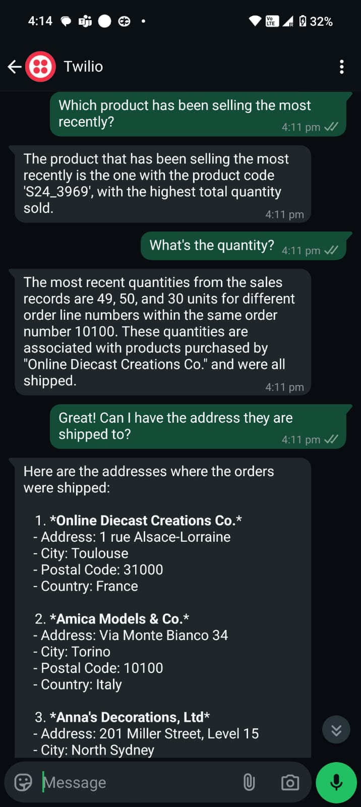

# SQL WhatsApp Agent - Natural Language Database Interface

A sophisticated AI-powered service that enables business users to query their databases using natural language through WhatsApp. Built with FastAPI, LangChain, and GPT-4, this agent translates everyday business questions into SQL queries and returns human-readable responses.

## 📱 Demo Screenshot

## 🚀 Key Features

-   **Natural Language Interface**: Ask questions in plain English - no SQL knowledge required
-   **WhatsApp Integration**: Query your database directly through WhatsApp
-   **Intelligent Context Management**: Maintains conversation history for follow-up questions
-   **Enterprise-Ready**:
    -   Secure SQL Database integration
    -   Real-time query processing
    -   Error handling and input validation
    -   Session-based conversation history

## 💡 Business Use Cases

-   **Sales Analysis**: "Show me top 5 customers by revenue this quarter"
-   **Inventory Queries**: "Which products are running low on stock?"
-   **Performance Metrics**: "Compare sales performance across regions"
-   **Quick Reports**: "What's the total revenue for last month?"

## 🛠️ Technology Stack

-   **Backend Framework**: FastAPI
-   **AI Components**:
    -   OpenAI GPT-4 for natural language understanding
    -   LangChain for agent orchestration
-   **Database**: Azure SQL Database
-   **Messaging**: Twilio WhatsApp Business API
-   **Deployment**: Docker containerization

## 🧪 Local Testing

To try the application on your local machine:

-   **Install the requirements**: `pip install -r requirements.txt`
-   **Start the application**: `uvicorn main:app --reload`
-   **Test with FastAPI Docs**: `http://localhost:8000/docs`
